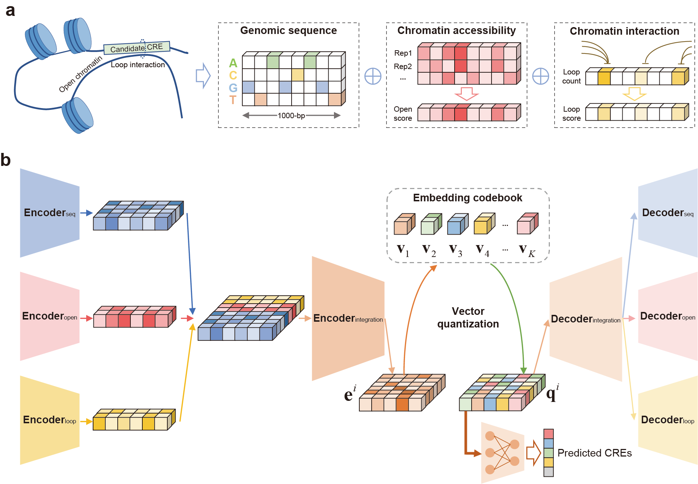

# CREATE: Cis-Regulatory Elements identificAtion via discreTe Embedding



## Installation  

```  
Requiements:  
1. Python 3.7 or later version  
2. Packages:  
    torch (>=1.10.0)  
    numpy (1.18.2)  
    tqdm (4.26.0)  
    scikit-learn (0.23.2)
  
Package installation:

$ git clone https://github.com/cuixj19/CREATE.git       
```

## Tutorial
We provide a [quick-start notebook](https://github.com/cuixj19/CREATE/blob/main/example/example.ipynb) for the training, evaluation and visualization of CREATE.


## Run   
**CREATE.py is used as a command line tool for training model.**  
```  
$ python CREATE.py -d input_file -o output_dir
```

**Optional arguments:**
```  
    data_path, -d
        A path of DNA sequence (chromatin accessibility and chromatin interaction data). Default: './example/'.
    num_class, -n
        The number of types of CREs. Default: 5.
    multi
        Multimodal data used as input in the model. Default: ['seq','open','loop'].
    test_aug
        Augmentation for CREs during testing process. Default: 1.
    train_aug
        Augmentation for each kind of CREs during training process. Default: [1,1,1,1,1].
    stride
        Window stride for data augmentation. Default: 10.
    batch_size
        Number of samples per batch to load. Default: 1024.
    enc_dims
        The number of nodes in the layers of encoder. Default: [512, 384, 128].
    dec_dims
        The number of nodes in the layers of encoder. Default: [200, 200].
    embed_dim
        The dimension of latent embeddings. Default: 128.
    n_embed
        The size of codebook. Default: 200.
    split
        The number of split quantizations. Default: 16.
    ema
        If True, adopt the exponential moving average (EMA) to update the codebook instead of the codebook loss. Default: True.
    e_loss_weight
        The weight of encoder loss designed for encoder. Default: 0.25.
    mu
        The update ratio of codebook when ema is True. Default: 0.01.
    open_loss_weight
        The weight of reconstruction open loss. Default: 0.01.
    loop_loss_weight
        The weight of reconstruction loop loss. Default: 0.1.
    lr
        Learning rate. Default: 5e-5.
    max_epoch
        Max epochs for training. Default: 300.
    pre_epoch
        Pre-epochs for training before incorporating the classification loss. Default: 50.
    seed
        Random seed for torch and numpy. Default: 0.
    gpu
        Index of GPU to use if GPU is available. Default: 0.
    outdir, -o
        Output directory. Default: './output/'.
```


## Contact 
If you have any questions, you can contact me from the email: <cuixj19@mails.tsinghua.edu.cn>

